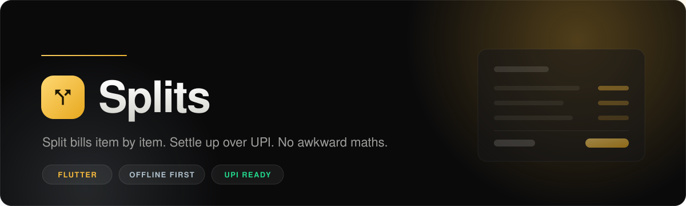

<p align="center">
  
</p>

<p align="center">
  
  
  
  
  
</p>

---

## Overview

**Splits** is a bill splitting app for people who are tired of dividing a restaurant bill
by the number of heads when three of them did not order dessert.

Most splitting apps divide the *total*. Splits divides the *items*. You add each line from
the receipt, pick who actually shared it, and the app works out exactly what every person
owes the one who paid. When it is time to settle, a UPI deep link opens the payer's app
with the amount pre-filled, and a single tap sends a WhatsApp reminder to whoever is
dragging their feet.

Everything is stored on the device. No account, no server, no sign-up.

---

## Contents

- [Why item-level splitting](#why-item-level-splitting)
- [Features](#features)
- [How the split engine works](#how-the-split-engine-works)
- [Design system](#design-system)
- [Architecture](#architecture)
- [Getting started](#getting-started)
- [Building a release](#building-a-release)
- [Testing](#testing)
- [Contributing](#contributing)
- [Authors](#authors)
- [License](#license)

---

## Why item-level splitting

Consider a table of four. The bill is 2,400. An even split says everyone pays 600.

But one person skipped the starters, another had two cocktails, and a third only wanted
rice. Splitting evenly quietly overcharges the light eaters every single time, which is
exactly the thing nobody wants to bring up at the table.

Splits records the bill the way it was actually consumed:

| Item         | Price | Shared by            | Each |
| ------------ | ----: | -------------------- | ---: |
| Starters     |   600 | Bala, Anjali, Rahul  |  200 |
| Biryani x4   | 1,200 | Everyone             |  300 |
| Cocktails x2 |   500 | Bala                 |  500 |
| Rice         |   100 | Karthik              |  100 |

That works out to Bala 1,000, Anjali 500, Rahul 500, and Karthik 400. Karthik pays 400
instead of 600, nobody does arithmetic at the table, and the payer sees one clear list of
who owes them what.

---

## Features

### Groups and members

- Create a group for any recurring set of people, such as a trip, a flat, or a regular
  dinner crowd
- Assign a default payee, the person who usually fronts the bill
- Per-group currency, chosen from rupee, dollar, euro, pound, and yen
- Swipe a group to delete it, with a confirmation step

### Splits and items

- Each group holds many splits, one per occasion, such as Dinner or Hotel
- Add items with a name and price, then select exactly who shared each one
- A live preview shows the per-person amount as you type the price
- Select all or clear all members in a single tap
- **Locked shares**: pin one person's contribution to a fixed amount and the remainder is
  redistributed among everyone else, useful when somebody pays a specific part
- Close a split to freeze it, and reopen it later if something was missed

### Settling up

- A summary screen showing exactly what each person owes the payer
- Mark individual people as paid, tracked per split
- **UPI deep link** that opens any UPI app with the payee, amount, and note pre-filled
- **WhatsApp reminders** with a pre-written message for a single person
- Share the whole summary as formatted text to any app

### Interface

- Full dark and light themes, switchable from the home screen
- Gold and chrome visual identity built on a true neutral black
- Tabular figures, so amounts line up cleanly down a column
- Motion on list entry, card presses, and state changes, kept short and purposeful
- Haptic feedback on every meaningful tap

---

## How the split engine works

All money logic lives in [`lib/utils/split_calculator.dart`](lib/utils/split_calculator.dart)
as pure functions with no Flutter or storage dependencies, which is what makes it directly
testable.

### Even division with exact totals

Dividing 100 between three people gives 33.333... Rounding each share to 33.33 loses a
cent, and the shares no longer add up to the bill.

Splits floors every share to two decimals and gives the leftover to the last unlocked
member. Three people splitting 100 pay 33.33, 33.33, and 33.34. **The shares always sum to
the exact price**, which matters when the payer is reconciling against a real receipt.

### Locked shares

Marking a share as locked fixes that amount. The engine subtracts all locked amounts from
the item price and divides only the remainder among the unlocked members. Lock every
member and the split becomes fully manual.

### Outstanding balances

`groupOutstanding` reports what a group still owes, counting only splits that are open and
only members not yet marked paid. The payer's own share is excluded, since you cannot owe
money to yourself. The home screen buckets these totals per currency rather than adding
different symbols together.

---

## Design system

Defined once in [`lib/theme/app_theme.dart`](lib/theme/app_theme.dart) and consumed
everywhere through `AppPalette.of(context)`, so no screen hardcodes a colour.

### Accent

| Role                    | Hex       | Notes                                              |
| ----------------------- | --------- | -------------------------------------------------- |
| Gold, primary           | `#F5B93D` | Fills: buttons, selected chips, badges              |
| Gold, bright            | `#FFD873` | Upper stop of the hero gradient                     |
| Bronze, accent on light | `#9A6B0B` | Accent *text* in light mode, where gold is unreadable |
| Ink on gold             | `#1F1703` | Text and icons placed on a gold fill                |
| Chrome                  | `#AFC0CC` | Cool secondary, deliberately not gold               |

Gold is bright, so it works as a background but fails as text on white. Every accent is
therefore split into a fill value and a text value, and light mode substitutes bronze.
The same rule applies to the semantic colours below.

### Semantic

| Role     | Dark      | Light     | Used for                     |
| -------- | --------- | --------- | ---------------------------- |
| Positive | `#22D68A` | `#078351` | Paid, settled, money incoming |
| Negative | `#FF5C6A` | `#C22B3E` | Delete, validation errors     |
| Info     | `#52B4E8` | `#1B6F9E` | Active state, locked shares   |

### Surfaces

| Layer          | Dark      | Light     |
| -------------- | --------- | --------- |
| Background     | `#0A0A0B` | `#FAFAF8` |
| Surface        | `#151517` | `#FFFFFF` |
| Surface raised | `#1D1D20` | `#F4F4F1` |
| Surface high   | `#27272B` | `#E9E9E4` |

Dark surfaces are warm neutral graphite rather than pure black, so cards separate from the
background without heavy borders. Light surfaces are warm off-white rather than a clinical
blue-grey.

Typography is **Inter** throughout, with weights 800 and 900 reserved for headings and
amounts. Spacing and corner radii come from the `SplitsSpacing` and `SplitsRadius` tokens.

---

## Architecture

```
lib/
  main.dart                     Entry point, Hive setup, theme wiring
  models/
    models.dart                 Member, ItemShare, SplitItem, SplitSession, Group
    models.g.dart               Generated Hive type adapters
  providers/
    groups_provider.dart        Riverpod notifier, all reads and writes
  screens/
    home_screen.dart            Groups dashboard and outstanding total
    group_screen.dart           Members and the group's splits
    split_screen.dart           Items and per-member shares
    summary_screen.dart         Who owes what, settle up actions
    settings_screen.dart        Display name and UPI details
  theme/
    app_theme.dart              Palette, tones, tokens, ThemeData
  utils/
    router.dart                 go_router route tree
    split_calculator.dart       Pure money logic
  widgets/
    common_widgets.dart         Shared component library
```

### State and storage

State is managed with **Riverpod**. `GroupsNotifier` is the single writer; every mutation
persists to **Hive** and then re-emits the sorted group list, so the UI cannot drift out of
sync with what is on disk. Two boxes are used: `groups` for data and `prefs` for settings.

Because Hive is a local key-value store, the app is fully functional offline and holds no
personal data anywhere but the device.

### Navigation

Routing uses **go_router** with a nested tree that mirrors the data model:

```
/                                              Home
/settings                                      Settings
/group/:groupId                                Group
/group/:groupId/split/:splitId                 Split
/group/:groupId/split/:splitId/summary         Summary
```

### Dependencies

| Package                          | Role                       |
| -------------------------------- | -------------------------- |
| `flutter_riverpod`               | State management           |
| `hive`, `hive_flutter`           | Local persistence          |
| `go_router`                      | Declarative navigation     |
| `url_launcher`                   | UPI and WhatsApp deep links |
| `share_plus`                     | Native share sheet         |
| `google_fonts`                   | Inter typeface             |
| `flutter_animate`                | Entrance and state motion  |
| `flutter_slidable`               | Swipe to delete            |
| `uuid`                           | Stable entity identifiers  |

---

## Getting started

### Prerequisites

- Flutter SDK 3.41 or newer, with Dart 3.11
- Android Studio or Xcode for device tooling
- A physical device or emulator

Confirm the toolchain is healthy:

```bash
flutter doctor
```

### Run

```bash
git clone https://github.com/<your-username>/splits-app.git
cd splits-app
flutter pub get
flutter run
```

### Regenerating Hive adapters

`models.g.dart` is generated. If you change any annotated model, rebuild it:

```bash
dart run build_runner build --delete-conflicting-outputs
```

### Setting up UPI

Open **Settings** in the app and enter the UPI ID that should receive payments, plus the
name to display in the UPI app. Once set, every unpaid member in a summary gets a Pay
button that opens their UPI app with the amount already filled in.

---

## Building a release

Android APK:

```bash
flutter build apk --release
```

Android App Bundle for the Play Store:

```bash
flutter build appbundle --release
```

iOS, which requires macOS and a configured signing identity:

```bash
flutter build ipa --release
```

---

## Testing

The split engine is covered by unit tests spanning even division, rounding remainders,
locked shares, per-member totals, outstanding balances, currency formatting, and UPI link
construction.

```bash
flutter test
```

Static analysis:

```bash
flutter analyze
```

---

## Contributing

Contributions are welcome. Start with [`CONTRIBUTING.md`](CONTRIBUTING.md) for the local
setup, coding conventions, and pull request process.

Everyone taking part is expected to follow the
[Code of Conduct](CODE_OF_CONDUCT.md). To report a security issue, please read
[`SECURITY.md`](SECURITY.md) rather than opening a public issue.

---

## Authors

<table>
  <tr>
    <td align="center" width="180">
      <a href="https://github.com/Balamurugan1962">
        
      </a>
      <br><b>Bala</b><br>
      <a href="https://github.com/Balamurugan1962">@Balamurugan1962</a>
      <br><sub>Designed and Development for Web</sub>
    </td>
    <td align="center" width="180">
      <a href="https://github.com/techieRahul17">
        
      </a>
      <br><b>Rahul</b><br>
      <a href="https://github.com/techieRahul17">@techieRahul17</a>
      <br><sub>Designed and Developed for Mobile Phones</sub>
    </td>
  </tr>
</table>

---

## License

Released under the MIT License. See [`LICENSE`](LICENSE) for the full text.
